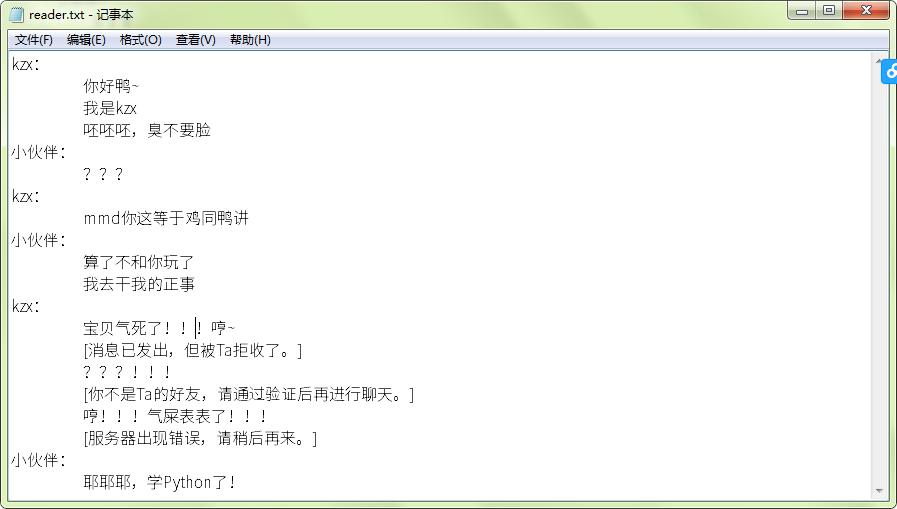

# Python学习笔记（14）——当来自文件世界的精灵们，跑到了Python中……

开始之前，我们问一个问题：

请问你怎么知道下面这个玩意儿写了些什么？？？


小伙伴：答，靠猜呗。(⊃･ᴥ･)つ

kzx：

好了，现在就告诉你它的内容。

整个笔记都要用，一定记牢。

```
kzx：
	你好鸭~
	我是kzx
	呸呸呸，臭不要脸
小伙伴：
	？？？
kzx：
	mmd你这等于鸡同鸭讲
小伙伴：
	算了不和你玩了
	我去干我的正事
kzx：
	宝贝气死了！！！哼~
	[消息已发出，但被Ta拒收了。]
	？？？！！！
	[你不是Ta的好友，请通过验证后再进行聊天。]
	哼！！！气屎表表了！！！
	[服务器出现错误，请稍后再来。]
小伙伴：
	耶耶耶，学Python了！
```

不用复制了，直接就可以从这里下载：[reader.txt](../../document/reader.txt)。

接下来教你如何读取这个文件。

## 1.字符与字节精灵：文本文件的构成

我们打开一个文本文件，一般是这样的：



但是在电脑的世界里，它是这样的：

```python
1101011 1111010 1111000 1111111100011010 1010 1001 100111101100000 101100101111101 1001111000101101 1111110 1010 1001 110001000010001 110011000101111 1101011 1111010 1111000 1010 1001 101010001111000 101010001111000 101010001111000 1111111100001100 1000000111101101 100111000001101 1000100110000001 1000000100111000 1010 101110000001111 100111100011001 100111100110100 1111111100011010 1010 1001 1111111100011111 1111111100011111 1111111100011111 1010 1101011 1111010 1111000 1111111100011010 1010 1001 1101101 1101101 1100100 100111101100000 1000111111011001 111101101001001 100111010001110 1001111000100001 101010000001100 1001111000101101 1000101110110010 1010 101110000001111 100111100011001 100111100110100 1111111100011010 1010 1001 111101110010111 100111010000110 100111000001101 101010010001100 100111101100000 111001110101001 100111010000110 1010 1001 110001000010001 101001110111011 101111001110010 110001000010001 111011010000100 110101101100011 100111010001011 1010 1101011 1111010 1111000 1111111100011010 1010 1001 101101110011101 1000110100011101 110110000010100 110101101111011 100111010000110 1111111100000001 1111111100000001 1111111100000001 101010011111100 1111110 1010 1001 1011011 110110110001000 110000001101111 101110111110010 101001111010001 101000111111010 1111111100001100 100111101000110 1000100010101011 1010100 1100001 110001011010010 110010100110110 100111010000110 11000000000010 1011101 1010 1001 1111111100011111 1111111100011111 1111111100011111 1111111100000001 1111111100000001 1111111100000001 1010 1001 1011011 100111101100000 100111000001101 110011000101111 1010100 1100001 111011010000100 101100101111101 101001111001011 1111111100001100 1000101111110111 1001000000011010 1000111111000111 1001101010001100 1000101111000001 101010000001110 101000110001101 1000111111011011 1000100001001100 1000000001001010 101100100101001 11000000000010 1011101 1010 1001 101010011111100 1111111100000001 1111111100000001 1111111100000001 110110000010100 101110001001110 1000100001101000 1000100001101000 100111010000110 1111111100000001 1111111100000001 1111111100000001 1010 1001 1011011 110011100001101 101001010100001 101011001101000 101000111111010 111001110110000 1001010100011001 1000101111101111 1111111100001100 1000101111110111 111101000001101 101010000001110 101000110001101 110011101100101 11000000000010 1011101 1010 101110000001111 100111100011001 100111100110100 1111111100011010 1010 1001 1000000000110110 1000000000110110 1000000000110110 1111111100001100 101101101100110 1010000 1111001 1110100 1101000 1101111 1101110 100111010000110 1111111100000001
```

是不是感觉好像天书一般？


其实，这些东西才能拿给电脑看，其他是不能滴。

**CPU（中央处理器）**大家都见过吧？就是下面这俩玩意儿：

CPU只能处理0与1这俩玩意儿（也就是逢二进一的**二进制**），直接把文件给他甩过来是不行滴。


但是如果给他二进制，他立马就能处理，并展现在用户面前。


然后变成大家见到的字符，比如现在你看到的Python学习笔记，就是一个个的字符组成的。

通俗一点，字符就是**字**，比如`a`就是一个字符。

现在，让我们来写一写读取这些字符的代码吧~

---

## 2.读取字符，连字成句

把大象拿出冰箱需要三步，Python读取文件也需要三步：`打开->读取->关闭`。

格式为：

```python
f = open(path,mode,encoding=xxx......)
s = f.read(length)
f.close()
```

比如刚才的文件，写出来就是：

```python
f = open('reader.txt','r',encoding='utf-8')
s = f.read()
print(s)
f.close()
```

其实，这个读取的函数`f.read(length)`，是进行了一个字节一个字节的读取，直到读取至length的长度。如果length为空，它会读取所有的文字。

在上面，我们使用r开关打开reader.txt，编码为utf-8。打开后，使用read读取全部，并关闭。

所以执行结果如下：

```
kzx：
	你好鸭~
	我是kzx
	呸呸呸，臭不要脸
小伙伴：
	？？？
kzx：
	mmd你这等于鸡同鸭讲
小伙伴：
	算了不和你玩了
	我去干我的正事
kzx：
	宝贝气死了！！！哼~
	[消息已发出，但被Ta拒收了。]
	？？？！！！
	[你不是Ta的好友，请通过验证后再进行聊天。]
	哼！！！气屎表表了！！！
	[服务器出现错误，请稍后再来。]
小伙伴：
	耶耶耶，学Python了！
```

接下来，有I就有O，我们开始学习写入吧。

## 3.写入字符，格式要规范

把大象放进冰箱需要三步，Python写入文件也需要三步：`打开->写入->关闭`。

写入的函数：

```python
f.write(str)
```

有两种模式：

- `w`：所有内容清空，重新进行写入。
  比如，修改代码如下：
  
  ```python
  f = open('reader.txt','w',encoding='utf-8')
  f.write('小伙伴：\n')
  f.write('\t你好呀！')
  f.close()
  ```
  
  /t是模拟<kbd>TAB</kbd>键显示的内容。
  
  打开reader.txt，效果如下：
  
  ```python
  小伙伴：
  	你好呀！
  ```
  
- `a`：不清空任何内容，从最后的指针开始写入。

  比如，修改代码如下：
  
  ```python
  f = open('reader.txt','a',encoding='utf-8')
  f.write('\n\t嘿嘿嘿......')
  f.close()
  ```
  
  打开reader.txt，效果如下：
  
  ```python
  kzx：
  	你好鸭~
  	我是kzx
  	呸呸呸，臭不要脸
  小伙伴：
  	？？？
  kzx：
  	mmd你这等于鸡同鸭讲
  小伙伴：
  	算了不和你玩了
  	我去干我的正事
  kzx：
  	宝贝气死了！！！哼~
  	[消息已发出，但被Ta拒收了。]
  	？？？！！！
  	[你不是Ta的好友，请通过验证后再进行聊天。]
  	哼！！！气屎表表了！！！
  	[服务器出现错误，请稍后再来。]
  小伙伴：
  	耶耶耶，学Python了！
  	嘿嘿嘿......
  ```
  

接下来，好戏继续上演~

---

## 4.上下文管理，简单易用

很多人会说：为什么我一定要写上`f.close()`呢？？？

不信，我们来试一下。将w模式的代码删掉f.close()看看：

```python
f = open('reader.txt','w',encoding='utf-8')
f.write('小伙伴：\n')
f.write('\t你好呀！')
```

打开reader.txt，效果如下：

```python
```

？？？

怎么肥四？一片空白？

这是因为，**Python为了提高效率，会把内容加载到缓存区中，关闭文件时，一次写入，绝对不会把RAM搞瘫痪。**

你要学会C#的话，读一下内存试试！

那，有没有可以不写close()的方式呢？

有哇！比如`with open() as f`。

比如，修改成如下：

```python
with open('reader.txt','w',encoding='utf-8') as f:
    f.write('小伙伴：\n')
    f.write('\t你好呀！')
```

打开reader.txt，效果如下：

```python
小伙伴：
	你好呀！
```

怎么样，是不是很快捷呢。

---

好的，今天的文章就到这里。

散会~

