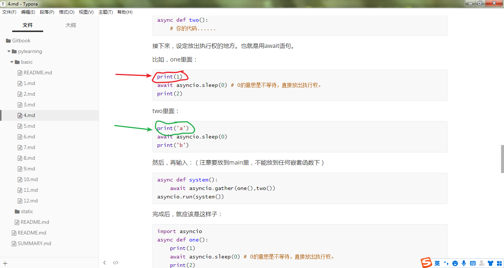
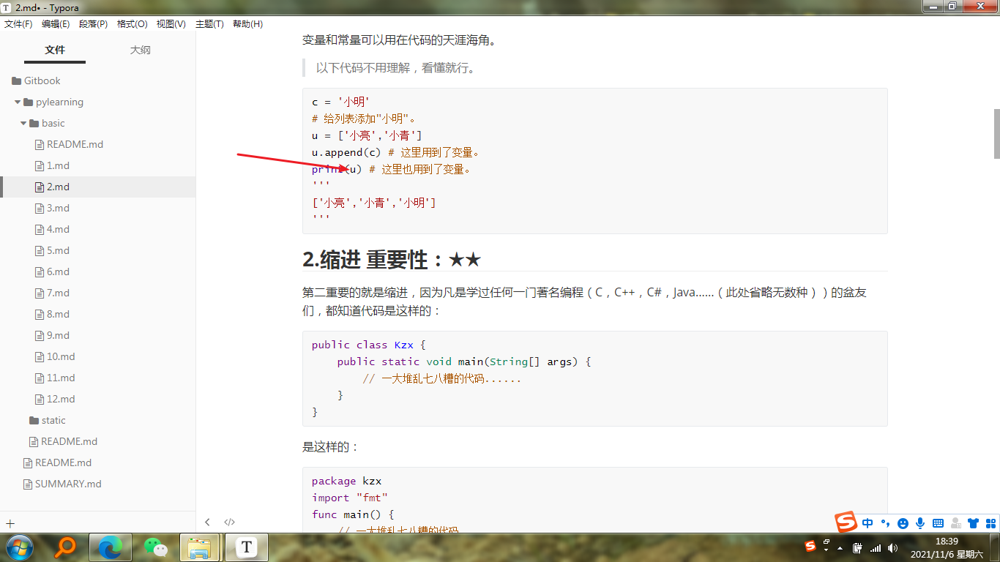

# Python学习笔记（5）——类型

> 在看完本文后，请看后面的更新。

接上次（应该是上上次……），这次抛开“不正经”，继续给大家介绍小知识。

上一弹详见：[Python学习笔记（4）——Asyncio](https://zhuanlan.zhihu.com/p/399206057)

------

## 1.我们以前写的都是甚么鬼

大家是不是都很好奇之前我们在学习Python的时候，为什么有时候print不带引号，有时候带：





> 红色代表没带，绿色代表带了。

那么没带和带有什么区别吗？

当然有啦。

在示例1中，红色箭头指向的是整数（Int，在SQLite中叫Integer），可以用运算符四法宝（+-\*/）计算。而绿色指向的是字符串（Str，在其它编程语言中叫String），可以用+和\*计算。

> 更多运算符将在[Python学习笔记（6）](6.md)中找到，尽请期待。

在示例2中，红色箭头指向的是变量（Value）。变量就不用我多说了吧，你在[Python学习笔记（2）——你不得不知道的小常识](2.md)里就能找到。

那么，我们今天就开始认识他们，以及其他小玩意儿。

------

## 2.正式开始认识

值得一提的是，在交互式python中输入各种类型的数据，都能得到回应。而巧妙运用运算符四法宝，还能更酷。


## 2.1.整数（下文简称Int）

正如前面所说，运算符四法宝可以计算Int。

```python
print(1+1,1-1,1*1,1/1,sep=',')
'''
2,0,1,1
'''
```

Int一般用在输出数字的时候（虽然用Str也能达到，但使用Int可以更灵活），和计算数字的时候，有时在人机交互时，还可以把Int当做选项。如：

```python
print(1)
'''
1
'''
print(1-1+1)
'''
1
'''
print(input('>'))
'''
>（输入：1）
1
'''
```

## 2.2.字符串

+和*也可以运算字符串，嘿嘿嘿。

```python
print('c'+'c')
'''
cc
'''
print('c'*2)
'''
cc
'''
```

在这里有必要说说字符串怎么表示。

下面3个都是字符串的表示方法：

```python
'我是字符串，只能转义：\''
"我也是字符串，我可以输入:''"
'''
我还是字符串，
可以换行，
还可以输入：'',""
'''
'不过，\n我也能换行呀'
# 输出：
'''
我是字符串，只能转义：'
我也是字符串，我可以输入:''
我还是字符串，
可以换行，
还可以输入：'',""
不过，
我也能换行呀
'''
```

> 以上含有转义字符。我附上一张表，欢迎自查。


也就是'str'（单引号），"str"（双引号）和'''str'''（三引号）。

> 值得一提的是，Python好像是唯一支持单引号的编程语言了。

Str是最常用的数据类型。input()返回的就是Str。如：

```python
print(type('u'))
'''
<class 'str'>
'''
```

> 值得一提的是，type()可以检测类型。

## 2.3.布尔（Boolean，简称Bool）

布尔只有两种表现形式：

```python
True # 真
False # 假
```

布尔语句在判断中最常见了。

```python
if True:
    print(1)
else:
    print(2)
'''
1
'''
```

## 2.3（番外）

在这里有必要提一下判断。

判断可是所有编程语言里都会带的玩意儿。在这里有必要学学。

判断的表现形式：

```python
if ONE_EXPRESSION:
    # 如果这个运算等于布尔值True，运行我。
elif ANOTHER_EXPRESSION: # elif可以省去。
    # 如果这个运算等于布尔值True，运行我。
else: # else可以省去。
    # 如果两个运算等于布尔值False，才运行我。
```

如：

```python
if 1>9: # 1大于9是绝对不可能的，所以不会运行下面已缩进的代码。
    print(1)
elif 1<0: # 1小于0也是绝对不可能的，所以不会运行下面已缩进的代码。
    print(2)
else: # 上面两个都没有运行，所以要运行下面已缩进的代码。
    print(3)
'''
3
'''
```

以上代码中，1大于9和1小于0都不可能，所以会运行else下的代码。

> 值得一提的是，像1+1,3*3等，如果=后面的数字与运算结果一样，也会返回布尔值。

```python
if 1+1=2:
    print(1)
'''
1
'''
```

需要注意的是，在有elif的情况下，不能舍去else。

> 9.8更新：这段中=应该是==！！具体情况详见：[Python学习笔记（6）——运算符](https://zhuanlan.zhihu.com/p/408307496)

## 2.4.字典与列表

字典也算是很重要的知识点。

字典的表示方式如下：

```python
我是一个字典 = {'一个名字':'一个值','另一个名字':'另一个值'}
```

名字是很重要的哦，一定要记清！

接下来，再取值时要用“我是一个字典[我是一个名字]”。

如：

```python
我是一个字典 = {'一个名字':'一个值','另一个名字':'另一个值'}
print(我是一个字典['一个名字'])
'''
一个值
'''
```

字典一般用来取值。如：

```python
name = {1:'小明',2:'小亮',3:'小红'}
print(name[1])
'''
小明
'''
```

还有一个，那就是列表。

列表的表示方式如下：

```python
我是一个列表 = [一个值,另一个值]
```

接下来，再取值时要用“我是一个列表[我是索引]”。

如：

```python
我是一个列表 = [一个值,另一个值]
print(我是一个列表[0])
'''
一个值
'''
```

在这里说一下，Python的索引是从0开始的。比如：


## 2.5.更酷的：类

类是自定义的类型。Python就是面向对象/类的编程。

类中可以有多种变量，在实例化后即可使用。

类的定义为：

```python
class ImClass:
    # 一堆东西......
```

ImClass就是一个类了。

前面说类中可以有多种变量。如：

```python
class Animal:# 定义动物类。
    type = '一只动物' # 定义变量type。
```

> 值得一提的是，类的名字必须严格遵守骆驼命名法。请大家自行百度。

在实例化后（实例化方法：我是变量 = 我是类()），即可调用与赋值。拿前面的Animal（动物类）举例：

```python
一只动物 = Animal()
一只动物.type = '动物'
print(一只动物.type)
'''
动物
'''
```

------

好啦，这就是本期的内容！

散会~


----------------* 下方文章为2021.8.29追加，上方为2021.8.28完成撰写 *----------------

## 2.6.浮点数（Float）

浮点数就是像2.6,9.4,3.7这样的数。

虽然它也能用运算符四法宝，但总会有误差。如：

```python
>>> 0.1+0.2
0.30000000000000004
>>> 0.1+0.1-0.2
0.0
>>> 0.1+0.1+0.1-0.3
5.551115123125783e-17
>>> 0.1+0.1+0.1-0.2
0.10000000000000003
```

> 以上代码来自C语言中文网，原文链接：[Python浮点数精度问题（包含解决方案）](https://link.zhihu.com/?target=http%3A//c.biancheng.net/view/5599.html%23%3A~%3Atext%3D%E5%B0%B1%20Python%20%E7%9A%84%E6%B5%AE%E7%82%B9%E6%95%B0%E8%BF%90%E7%AE%97%E8%80%8C%E8%A8%80%EF%BC%8C%E5%A4%A7%E5%A4%9A%E6%95%B0%E8%AE%A1%E7%AE%97%E6%9C%BA%E6%AF%8F%E6%AC%A1%E8%AE%A1%E7%AE%97%E8%AF%AF%E5%B7%AE%E4%B8%8D%E4%BC%9A%E8%B6%85%E8%BF%87%202%2C53%EF%BC%8C%E8%BF%99%E5%AF%B9%E4%BA%8E%E5%A4%A7%E5%A4%9A%E6%95%B0%E4%BB%BB%E5%8A%A1%E6%9D%A5%E8%AF%B4%E5%B7%B2%E7%BB%8F%E8%B6%B3%E5%A4%9F%E4%BA%86%E3%80%82%20%E5%A6%82%E6%9E%9C%E9%9C%80%E8%A6%81%E9%9D%9E%E5%B8%B8%E7%B2%BE%E7%A1%AE%E7%9A%84%E7%BB%93%E6%9E%9C%EF%BC%8C%E5%8F%AF%E4%BB%A5%E4%BD%BF%E7%94%A8%20decimal%20%E6%A8%A1%E5%9D%97%EF%BC%88%E5%85%B6%E5%AE%9E%E5%B0%B1%E6%98%AF%E5%88%AB%E4%BA%BA%E5%BC%80%E5%8F%91%E5%A5%BD%E7%9A%84%E7%A8%8B%E5%BA%8F%EF%BC%8C%E6%88%91%E4%BB%AC%E5%8F%AF%E4%BB%A5%E7%9B%B4%E6%8E%A5%E6%8B%BF%E6%9D%A5%E7%94%A8%EF%BC%89%EF%BC%8C%E5%AE%83%E5%AE%9E%E7%8E%B0%E7%9A%84%E5%8D%81%E8%BF%9B%E5%88%B6%E6%95%B0%E8%BF%90%E7%AE%97%E9%80%82%E5%90%88%E4%BC%9A%E8%AE%A1%E6%96%B9%E9%9D%A2%E7%9A%84%E5%BA%94%E7%94%A8%E5%92%8C%E6%9C%89%E9%AB%98%E7%B2%BE%E5%BA%A6%E8%A6%81%E6%B1%82%E7%9A%84%E5%BA%94%E7%94%A8%E3%80%82)

那么只需要用Decimal就可完美解决。

在代码开头加上：

```python
from decimal import Decimal
```

就可以用"Decimal('浮点数')"转换后解决。如：

```python
a = Decimal('1.1')
b = Decimal('2.8')
c = Decimal('2.7')
>>> float(a+b-c)
''' # 准确的
1.2
'''
>>> 1.1+2.8-2.7
''' # 不准确的
1.1999999999999997
'''
```

> 值得一提的是，float('浮点数')可以把字符串变成浮点数。其他也是这样：int()转为整数，str()转为字符串。

----------------------------------------* 已经追加完毕 *----------------------------------------
